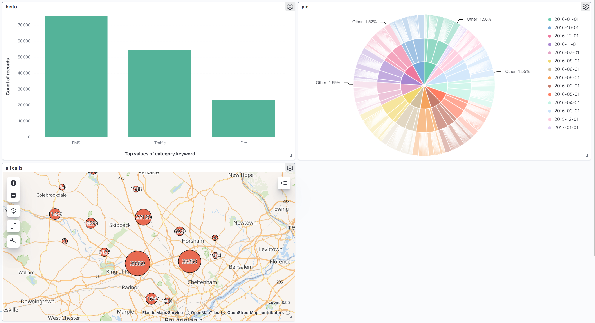
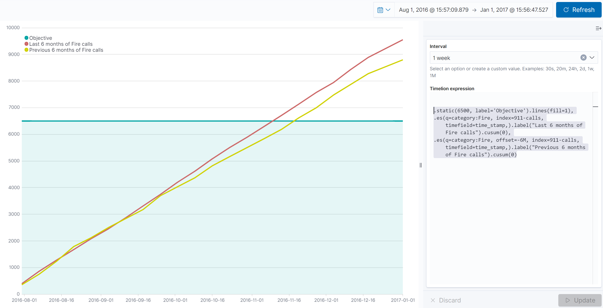

# 911 Calls avec ElasticSearch

## Import du jeu de données

Pour importer le jeu de données, complétez le script `import.js` (ici aussi, cherchez le `TODO` dans le code :wink:).

Exécutez-le ensuite :

```bash
npm install
node import.js
```

Vérifiez que les données ont été importées correctement grâce au shell (le nombre total de documents doit être `153194`) :

```
GET <nom de votre index>/_count
```

## Requêtes

À vous de jouer ! Écrivez les requêtes ElasticSearch permettant de résoudre les problèmes posés.


### Compter le nombre d'appels par catégorie
```
POST /911-calls/_search
{
   "size":0,
   "aggs":{
      "categories":{
         "terms":{
            "field":"category.keyword"
         }
      }
   }
}
```

### Trouver les 3 mois ayant comptabilisés le plus d'appels
```
POST /911-calls/_search
{
   "size":0,
   "aggs":{
      "by_month":{
         "date_histogram":{
            "field":"time_stamp",
            "calendar_interval":"month",
            "order":{
               "_count":"desc"
            }
         },
         "aggs":{
            "top3":{
               "bucket_sort":{
                  "sort":[
                     
                  ],
                  "size":3
               }
            }
         }
      }
   }
}
```


### Trouver le top 3 des villes avec le plus d'appels pour overdose
```
POST /911-calls/_search
{
   "size":0,
   "query":{
      "match":{
         "title":"overdose"
      }
   },
   "aggs":{
      "by_cities":{
         "terms":{
            "field":"twp.keyword"
         },
         "aggs":{
            "top3":{
               "bucket_sort":{
                  "sort":[
                     
                  ],
                  "size":3
               }
            }
         }
      }
   }
}
```


### Compter le nombre d'appels autour de Lansdale dans un rayon de 500 mètres
```
POST /911-calls/_count
{
   "query":{
      "geo_distance":{
         "distance":"500m",
         "point":[
            -75.283783,
            40.241493
         ]
      }
   }
}
```


## Kibana

Dans Kibana, créez un dashboard qui permet de visualiser :

* Une carte de l'ensemble des appels
* Un histogramme des appels répartis par catégories
* Un Pie chart réparti par bimestre, par catégories et par canton (township)

Pour nous permettre d'évaluer votre travail, ajoutez une capture d'écran du dashboard dans ce répertoire [images](images).




### Bonus : Timelion
Timelion est un outil de visualisation des timeseries accessible via Kibana à l'aide du bouton : 

Réalisez le diagramme suivant :


Envoyer la réponse sous la forme de la requête Timelion ci-dessous:  

```
.static(6500, label='Objective').lines(fill=1),
.es(q=category:Fire, index=911-calls, timefield=time_stamp,).label("Last 6 months of Fire calls").cusum(0),
.es(q=category:Fire, offset=-6M, index=911-calls, timefield=time_stamp,).label("Previous 6 months of Fire calls").cusum(0)
```


